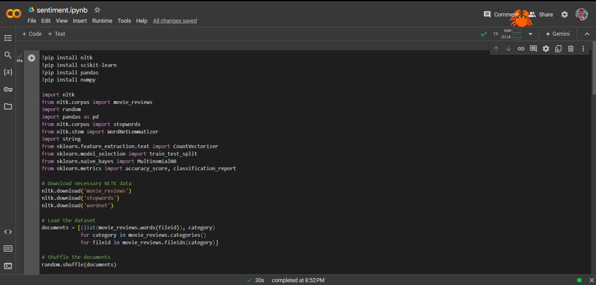
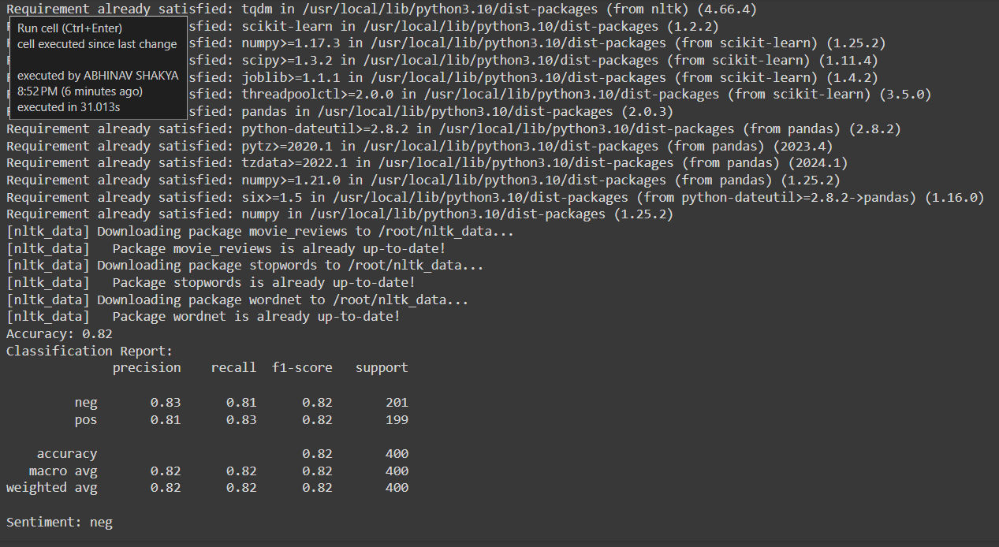

# Sentiment Analysis Tool

This repository contains a sentiment analysis tool developed using Python and the Natural Language Toolkit (NLTK). The tool classifies the sentiment of text data into positive, negative, or neutral categories.

## Screenshots

 

## Features

- Collect and preprocess text data from the NLTK movie reviews corpus.
- Develop a sentiment analysis model using the Naive Bayes classifier.
- Analyze the sentiment of new text samples.
    
## Usage

1. Run the Python script in Google Colab:

## Example

Here's an example of how to use the sentiment analysis tool:

```python
sample_text = "The movie was fantastic and I loved it!"
print(f'Sentiment: {analyze_sentiment(sample_text)}')
```
## Contributing

Contributions are welcome! Please open an issue or submit a pull request for improvements or suggestions.

## Contact

For any inquiries or questions, please contact [abhinavshakya063@gmail.com].

This README provides an overview of the project, installation instructions, usage examples, and the [MIT license](license).
